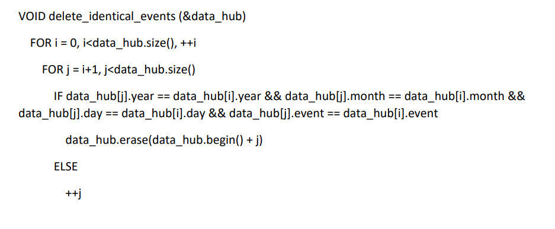
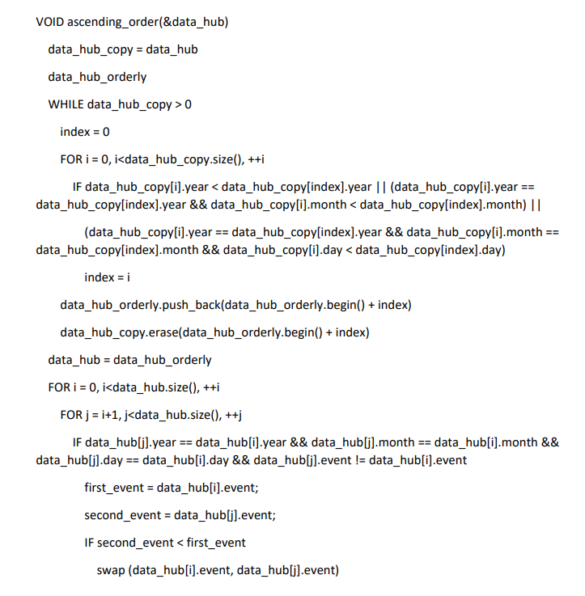
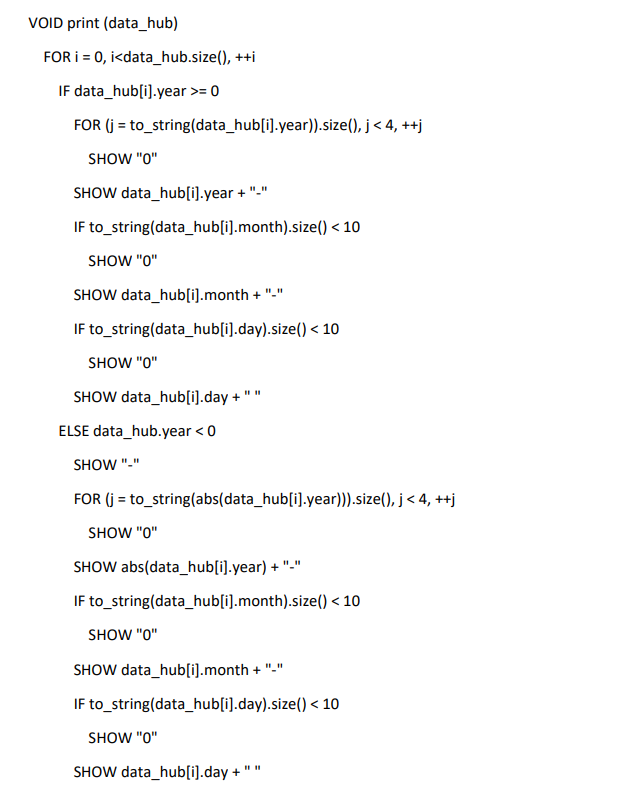
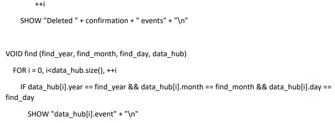

# EXAMEN-FINAL
## EL PROBLEMA
Eres un desarrollador C++ en una empresa y se te ha solicitado crear un modelo de base de
datos simple. Pero antes te piden investigar sobre todas las bases de datos existentes y
hacer una comparativa para justificar esta implementacion.

Entonces, primero se debe realizar dicha comparativa estudiar las existentes y escribir una
justificacion del desarrollo de un nuevo manejador de base de datos.

Luego, es necesario analizar el problema y escribir un programa en C++ que implemente el
trabajo con una base de datos simple (abreviado «BD»). El programa se comunicará con el
usuario a través de la entrada y salida estándar (flujos stdin y stdout).

Almacenaremos en nuestra BD pares del tipo: fecha, evento. Definiremos la fecha como una
cadena en el formato Año-Mes-Día, donde Año, Mes y Día son números enteros.

Definiremos el evento como una cadena de caracteres imprimibles arbitrarios sin
separadores dentro (espacios, tabulaciones, etc.). Un evento no puede ser una cadena vacía.
En una misma fecha pueden ocurrir muchos eventos diferentes, la BD debe ser capaz de
almacenarlos todos. No es necesario guardar eventos idénticos que ocurran el mismo día:
basta con guardar solo uno de ellos.

Nuestra BD debe entender ciertos comandos para que se pueda interactuar con ella:

- agregar evento: Add Fecha Evento
- eliminar evento: Del Fecha Evento
- eliminar todos los eventos de una fecha específica: Del Fecha
- buscar eventos en una fecha específica: Find Fecha
- imprimir todos los eventos de todas las fechas: Print

Todos los comandos, fechas y eventos en la entrada están separados por espacios. Los
comandos se leen desde la entrada estándar. En una línea puede haber exactamente un
comando, pero se pueden ingresar varios comandos en varias líneas. También pueden haber
líneas vacías en la entrada, las cuales deben ser ignoradas, y continuar procesando los
nuevos comandos en las líneas siguientes.
### Agregar evento (Add Fecha Evento)
Al agregar un evento, la BD debe recordarlo y luego mostrarlo durante la búsqueda (comando
Find) o impresión (comando Print). Si el evento especificado para una fecha determinada ya existe, se debe ignorar la repetición de su adición. En caso de una entrada correcta, el
programa no debe mostrar nada en la pantalla.
### Eliminar evento (Del Fecha Evento)
El comando debe eliminar un evento agregado anteriormente con el nombre especificado en
la fecha indicada, si existe. Si el evento se encuentra y se elimina, el programa debe mostrar
la línea "Deleted successfully" (sin comillas). Si no se encuentra el evento en la fecha
especificada, el programa debe mostrar la línea "Event not found" (sin comillas).
### Eliminar varios eventos (Del Fecha)
El comando elimina todos los eventos previamente agregados para la fecha indicada. El
programa siempre debe mostrar una línea en el formato "Deleted N events", donde N es la
cantidad de eventos encontrados y eliminados. N puede ser igual a cero si no hubo ningún
evento en la fecha especificada.
### Buscar eventos (Find Fecha)
Encuentra e imprime los eventos previamente agregados en la fecha indicada. El programa
debe imprimir solo los eventos, uno por línea. Los eventos deben estar ordenados en orden
ascendente según la comparación de cadenas (tipo string).
### Imprimir todos los eventos (Print)
Con este comando se puede mostrar todo el contenido de nuestra BD. El programa debe
imprimir todas las parejas Fecha Evento, una por línea. Todas las parejas deben estar
ordenadas por fecha, y los eventos dentro de una misma fecha deben estar ordenados en
orden ascendente según la comparación de cadenas (tipo string). Las fechas deben estar
formateadas de manera especial: AAAA-MM-DD, donde A, M, D son los dígitos de los
números del año, mes y día respectivamente. Si algún número tiene menos dígitos, debe
completarse con ceros, por ejemplo, 0001-01-01 es el primero de enero del primer año. No
necesitarás imprimir una fecha con un valor de año negativo.
### Manejo de errores de entrada
La entrada en esta tarea no siempre es correcta: tu programa debe manejar correctamente
algunos errores de entrada.
#### Qué errores de entrada manejar
Si el usuario ingresa un comando desconocido, el programa debe informar de ello, mostrando
la línea "Unknown command: COMMAND", donde COMMAND es el comando que ingresó el
usuario. Se considera comando la primera palabra en la línea (hasta el espacio).

Si la fecha no corresponde al formato Año-Mes-Día, donde Año, Mes y Día son números
enteros arbitrarios, el programa debe imprimir "Wrong date format: DATE", donde DATE es lo
que el usuario ingresó en lugar de la fecha (hasta el espacio). Ten en cuenta que las partes de la fecha están separadas por un guion exacto, y la fecha no debe contener caracteres
adicionales ni antes del año ni después del día. Las partes de la fecha no pueden estar vacías, pero pueden ser cero o incluso negativas.

Si el formato de la fecha es correcto, se debe verificar la validez del mes y el día.

Si el número del mes no es un número del 1 al 12, muestra "Month value is invalid: MONTH",
donde MONTH es el número de mes incorrecto, por ejemplo, 13 o -1.

Si el mes es correcto, pero el día no está en el rango de 1 a 31, muestra "Day value is invalid: DAY", donde DAY es el número de día incorrecto en el mes, por ejemplo, 39 o 0.

Ten en cuenta que:

* No es necesario verificar el valor del año por separado.
* No es necesario verificar la corrección del calendario: se considera que el número de
* días en cada mes es 31, no se necesita considerar años bisiestos.
Si tanto el mes como el día son incorrectos, se debe mostrar solo un mensaje de error sobre
el mes.
#### Ejemplos:
* 1-1-1 — fecha correcta
* -1-1-1 — fecha correcta (año -1, mes 1, día 1)
* 1--1-1 — fecha en formato correcto, pero con un mes incorrecto -1
* 1---1-1 — fecha en formato incorrecto: el mes no puede comenzar con dos guiones
* 1-+1-+1 — fecha correcta, ya que +1 es un número entero

Después de manejar cualquiera de los errores de entrada descritos y mostrar el mensaje, el
programa debe terminar su ejecución.
#### Qué errores de entrada no manejar
No se busca romper tu programa de todas las formas posibles, por lo tanto, aparte de lo
descrito en el punto anterior, puedes confiar en la corrección de la entrada. En particular, se garantiza que:
* Cada comando ocupa exactamente una línea completa, aunque en la entrada puede
haber líneas vacías (que deben ser ignoradas).
* Los eventos siempre contienen el número indicado de argumentos: después del
comando Add siempre siguen la fecha y el evento, después del comando Find siempre
sigue la fecha, después del comando Del siempre sigue la fecha y, posiblemente, el
evento, y el comando Print no contiene información adicional.
* Todos los comandos, fechas y eventos son cadenas no vacías y no contienen espacios u
otros caracteres de espacio. (En particular, nuestras pruebas no contienen el comando
"Add 2018-02-12", ya que no tiene un nombre de evento después de la fecha). Por otro
lado, el comando Del puede no contener un evento después de la fecha: en este caso,
se deben eliminar todos los eventos para la fecha especificada (ver sección "Eliminar
varios eventos")
* Aunque una fecha con un valor de año negativo se considera correcta, las pruebas están
diseñadas de tal manera que no necesitarás imprimirla en el comando Print.
#### Ejemplos
Entrada correcta:
> Add 0-1-2 event1

> Add 1-2-3 event2

> Find 0-1-2

> Del 0-1-2

Print
> Del 1-2-3 event2

> Del 1-2-3 event2

Salida:
> event1

> Deleted 1 events

> 0001-02-03 event2

> Deleted successfully

> Event not found

Entrada Incorrecta:
> Add 0-13-32 event1

Salida: 
> Month value is invalid: 13
### Observaciones
Conversión de un número a una cadena Para, teniendo el número MONTH, formar la cadena
«El valor del mes no es válido: MONTH», se puede utilizar la función to_string, que convierte
el número a una cadena. De esta manera, se puede formar la cadena necesaria de la
siguiente manera:
> string error = "Month value is invalid: " + to_string(month); language-cpp
#### Búsqueda en un diccionario constante
Al implementar este patrón, es posible que necesites utilizar la búsqueda con corchetes para
un diccionario pasado a la función por referencia constante. Como se mostró anteriormente,
esto no será posible, ya que el acceso a una clave inexistente con corchetes la agregará al
diccionario, lo cual no es permisible para un diccionario constante.

En este caso, en lugar de corchetes, utiliza el método at: en caso de ausencia de la clave,
lanzará una excepción y, por lo tanto, puede ser utilizado para un objeto constante.

Por ejemplo, en lugar del código
> void DoSomething(const map<int, int>& m) {

> //.

> if (m.count(key) > 0) {

> value = m[key]; / No compilara

> }

> //...

> }

Use este codigo:
> void DoSomething(const map<int, int>& m) {

> //...

>    if (m.count(key) > 0) {

> value = m.at(key); / Todo bien

> }

> //...

> }
## BASE DE DATOS 
Para empezar una base de datos es según Oracle(2024)“Una recopilación organizada de información o datos estructurados, que normalmente se almacena de forma electrónica en un sistema informático”.

Así que teniendo en cuenta lo anterior y la necesidad de implementar una base de datos en el programa se buscó las más famosas y oportunas y en la búsqueda las que más nos llamaron la atención fueron: MySQL, MongoDB y Microsoft SQL Server aunque sabemos que hay muchas más.
### MySQL

Para empezar MySQL es una base de datos de servicios para transacciones en tiempo real y análisis que las ventajas que tiene es que es en nube tiene una latencia baja y se puede configurar para OCI, AW y Azure con gran escalabilidad y adaptabilidad con el paso del tiempo-
### MongoDB.

MongoDB. Es una plataforma de construcción de base de datos no relacionales y de código abierto que utiliza documentos flexibles en lugar de tablas y filas para procesas y eliminar varias formas de datos, cual es elástico y es menos restrictivo y con más rendimiento que otros como MySQL además de su flexibilidad y rendimiento para aplicaciones.
### Microsoft SQL Server

En si Microsoft SQL Server no es una base de datos sino es un sistema de administración de bases de datos relacionales. y se conectan con los datos de SQL Server, pero gracias a su manejo de bases de datos puede ser una opción interesante.
### Conclusion
Pero la decisión de la base de datos existente e implementada es una base de datos creado en el propio código usando la librería “fstream” que tal como dice (cplusplus.com) es una librería que permite clases de input y output para operar en archivos.

Se basa en la creación de un documento “.txt” que recibe toda la información que ingresa el usuario que este bien y se actualiza con lo que ingresa el usuario para que no haya problema por si lo cierra el programa y que al abrir el programa se carga todo en el programa al iniciar.

La decisión fue porque permite una rápida conexión con el archivo de fácil acceso y lectura, ademas es especial y eficaz para el sistema actual del programa además de que no es necesario aprender ni implementar otro lenguaje de programación como SQL y se puede adaptar todo a través del código con una aceptable sencillez.
## ESTRUCTURA DE REPOSITORIO
## FUNCIONES Y ESTRUCTURAS
## DIAGRAMA DE FLUJO O PSEUDOCODIGO

## CREDITOS
Creditos a los autores: 
* Josue Balbontin 
* Alejandro Ramirez 
### Bibliografía
[¿Qué es una base de datos?](https://www.oracle.com/mx/database/what-is-database/)

[SQL Server](https://www.mysql.com/)

[MongoDB](https://www.mongodb.com/)

[¿Qué es MongoDB? ](https://www.ibm.com/es-es/topics/mongodb)

[Microsoft SQL server ](https://learn.microsoft.com/es-es/sql/sql-server/what-is-sql-server?view=sql-server-ver16)

---
**Creado en c++ con el compilador MinGW y el IDE Visual Studio Code**